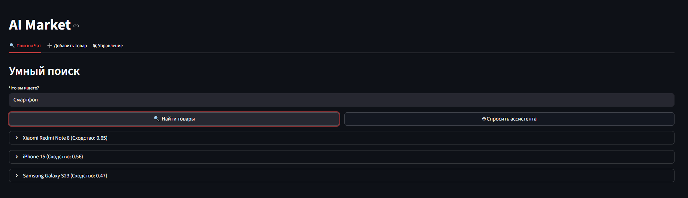
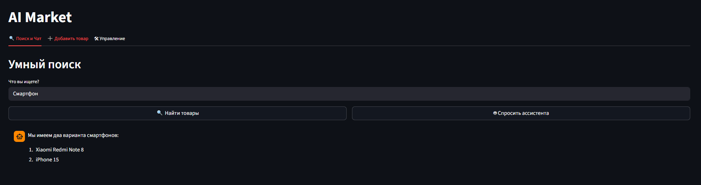
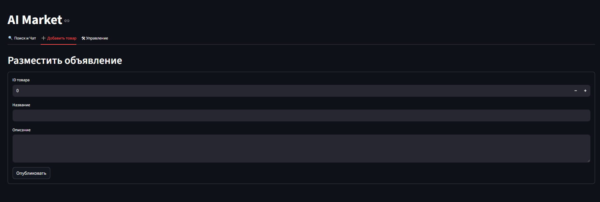
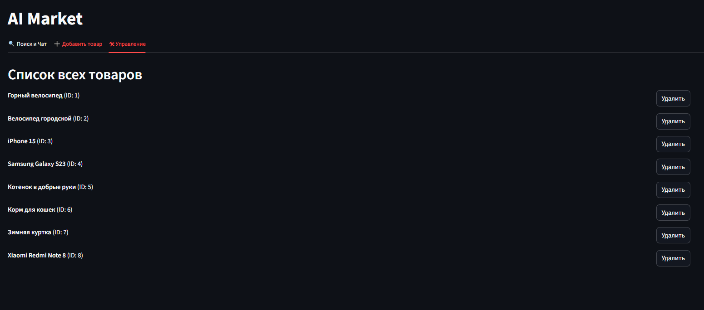

# Semantic Search & AI Agent


Интеллектуальный поисковый движок для маркетплейса, объединяющий семантический поиск по сходству векторов и автономного AI-агента. Проект демонстрирует современный подход к архитектуре **RAG (Retrieval-Augmented Generation)** и **Agentic AI**.

## Ключевые особенности
- **Semantic Search:** Поиск товаров по смыслу, а не по ключевым словам, с использованием мультиязычных эмбеддингов (`Sentence-BERT`).
- **Autonomous AI Agent:** Агент на базе **LangChain** и **Llama 3.2**, использующий **Tool Calling** для самостоятельного обращения к базе данных Qdrant.
- **Dynamic Indexing:** Полноценный CRUD. При добавлении товара через интерфейс система «на лету» генерирует векторы и обновляет поисковый индекс.
- **Microservice Architecture:** Разделение на векторное хранилище (Qdrant), API (FastAPI) и интерфейс (Streamlit).

---

## Архитектура системы

1. **Vector DB (Qdrant):** Хранит эмбеддинги товаров (комбинация Name + Description) и метаданные. Использует косинусное сходство для ранжирования.
2. **Backend (FastAPI):** 
   - Генерация эмбеддингов через `sentence-transformers`.
   - Оркестрация AI-агента.
   - REST API для управления товарами.
3. **AI Brain (Ollama + Llama 3.2):** Локальная языковая модель, выполняющая роль консультанта.
4. **Frontend (Streamlit):** Панель управления для поиска, добавления и удаления объявлений.

---

## Интерфейс приложения

<p align="left">
  <b>Умный поиск</b><br>
  <i>Используется qdrant для поиск по названию и описанию</i><br>
  
</p>
<p align="left">
  <b>чат с AI-ассистентом</b><br>
  <i>Агент анализирует запрос, находит релевантные товары в Qdrant и формулирует ответ.</i><br>
  
</p>

<br>

<p align="left">
  <b>Управление ассортиментом</b><br>
  <i>можно добавить какой-то предмет</i><br>
  
</p>
<p align="left">
  <b>Показ ассортимента</b><br>
  <i>Визуально понятно что есть в наличии</i><br>
  
</p>

---

## 🛠 Стек технологий
- **ML & NLP:** PyTorch, Sentence-Transformers (`paraphrase-multilingual-MiniLM-L12-v2`).
- **LLM Framework:** LangChain (AgentExecutor, Tool Calling).
- **Inference Engine:** Ollama (Llama 3.2).
- **Databases:** Qdrant (Vector Search Engine).
- **Backend:** FastAPI, Pydantic, HTTPX.
- **Frontend:** Streamlit.
- **DevOps:** Docker Compose, `.env` configuration.

---

## 📦 Инструкция по запуску

### 1. Подготовка окружения
Убедитесь, что у вас установлена **Ollama** и скачана модель:
```bash
ollama pull llama3.2
```

### 2. Настройка конфигурации
Создайте файл `.env` в корне проекта (см. `.env.example`):
```env
QDRANT_HOST=qdrant
OLLAMA_URL=http://host.docker.internal:11434
LLM_MODEL=llama3.2
```

### 3. Запуск через Docker Compose
```bash
docker compose up --build
```
- **Интерфейс:** [http://localhost:8501](http://localhost:8501)
- **API Swagger:** [http://localhost:8000/docs](http://localhost:8000/docs)

### 4. Первичная индексация
Для загрузки начального набора данных выполните:
```bash
uv run python app/index_data.py
```

---

## 📈 Почему это инженерный проект?
- **Optimization:** Реализована нормировка эмбеддингов и фильтрация результатов по порогу сходства (Confidence Score), что минимизирует галлюцинации модели.
- **Scalability:** Использование векторной БД вместо обычного перебора массивов позволяет системе работать с миллионами товаров.
- **Agentic Logic:** Вместо жестких сценариев (Chains) используется агент, который сам решает, когда ему нужны данные из базы, а когда он может ответить самостоятельно.

---

## 👨‍💻 Автор
Силков Александр — [@W1zard70](https://github.com/W1zard70)

---

### Финальный совет:
Перед тем как пушить на GitHub, убедись, что:
1. Ты добавил файлы **`.gitkeep`** в пустые папки (data, models и т.д.).
2. Ты добавил **`.env`** в `.gitignore`.
3. У тебя в репозитории лежит **`.env.example`**.
4. Ты сделал **скриншоты** и положил их в папку `docs/` внутри проекта.

**С этим проектом ты официально готов к собеседованиям в Авито и МТС на позиции Junior ML / NLP Engineer.** Удачи!